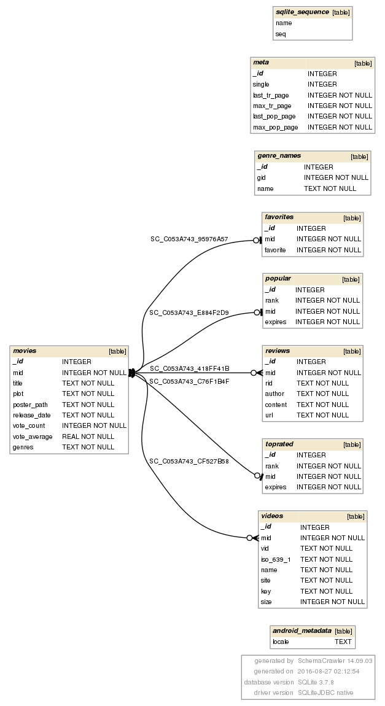

# Movies

This is project #2 from the udacity android nano degree program. The project requirements are
[online](https://goo.gl/EpF3N2).

The app source is divided into data, ui, and sync. I'll cover each in turn.

I am not an artsy GUI person, so this won't win any design awards. I took this as a learning
project to pick up how to write a ContentProvider, a SyncAdapter, various Fragment based
Activities that handle both the Activity and Fragment life cycles.  I took some care
to make sure no database query() or insert() calls were made on the UI thread.

## Data

 The data section is an SQLite content provider. The database schema:

 

The three main lists that are displayed are favorites, popular, and toprated. In each case,
we return a movies inner joined with the list based on the `mid` in each table and
movies left joined with the favorites list. This allows the details view access to all of the
 data it needs with a single cursor.

Bulk inserts are supported within a single transaction, which speeds up android devices
considerably.

I try to minimize the number of moviedb api calls. We prefetch the popular and toprated lists
but don't prefetch reviews or trailers as this would require two api calls per movie. Instead
we fetch and cache reviews (`.data.ReviewLoader`) and trailers (`.data.TrailerLoader`) on demand.

Genre names are loaded and cached (`.data.GenreNameMapper`)from the moviedb once after
initial installation.

The `.data.Contract` class contains interfaces that describe the column names, indices, and
default projections in the joined tables returned on calls to `query()`. It also has static
 functions that return fluent builders for the `ContentValues` needed for `insert()`.

## Sync

The sync package is pretty simple.

The `.sync.StubAuthenticatorService`  that I can reuse in other projects. I should have put it
 in a generic package, but I can just change the package name when I reuse the class.

The `.sync.MoviesSyncService` is just a couple of lines of code to create a `MoviesSyncAdapter` or
 an `IBinder`.

`.sync.MoviesSyncAdapter` contains all of the real code for synchronization. The moviedb api
returns 20 movies per page when fetching the toprated or popular lists. By default,
`MoviesSyncAdapter` will fetch 5 pages at a time from each list up to a MAX_PAGE=50. Every
SYNC_FLEXTIME (6 hrs +- 3hrs). An initial sync happens on application startup. All network
api calls are made using retrofit2.

## UI

I really like `RecyclerView`, but there is no `RecyclerView.Adapter` for `Cursor`. I grabbed
some stuff off of stackoverflow and subclassed RecyclerView.Adapter for a
`.ui.RecyclerViewCursorAdapter`.  I'm using this for both the posters grid layout and for
 the individual pages of the details view.

I like the `support.v4.view.ViewPager`. However, it won't take a `RecyclerView.Adapter` and the
2K+ detail fragments in memory didn't sound like a good idea.

For the details fragment I am doing a full page `ScrollView` for the individual details pages
 and putting it in a `RecyclerView` with a horizontal `LinearLayoutManager`
using the local `.ui.RecyclerViewCursorAdapter`.

This seems to do what you would want. If you scroll up or down, you can see all of the
details on a small screen. Scrolling side to side brings in details of different movies.
Side to side scroll is infinite (up to the number of movies).

A view pager locks in full pages on the screen by snapping them into place. I like that behavior
so I'm doing it here by subclassing `RecyclerView.OnScrollListener` and using it to snap
full details pages into place when the scrolling has stopped.

Details and Posters are Fragments with retainInstance true, so they should go through rotations
fine or jumping to other activities and back.

Reviews and trailers are both displayed in very simple ListActivities that are kicked off by
buttons in the Details fragment. I didn't want to put details and trailers directly in the
DetaislFragment because that would kick off network API calls for every detail that we
looked at. Just bring them if somebody cares.

I'm using Glide to load thumbnails and such for posters or details images.

Rather than fix the number of columns in the PostersFragment, I fix the column width in dp,
scale to pixels and have a GridAutoFitLayoutManager subclass of GridLayoutManager. The number
of columns in the PostersFragment will vary from device to device.

## TODO

Lot's of things come to mind:

* We should prune the database if/when it gets too big.
* We should fetch new genre names occasionally.
* Once we get trailers/reviews and cache them, we don't fetch them again. Should
  do that at some point.
* Should do a settings activity to control (among other things) when and how much data
  fetching to do.
* I should hook in stetho and do some more analysis.

